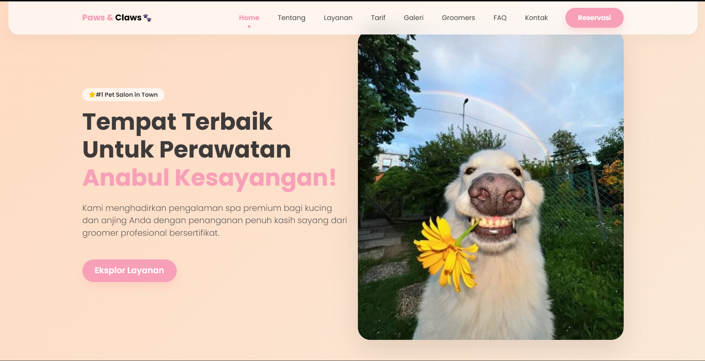
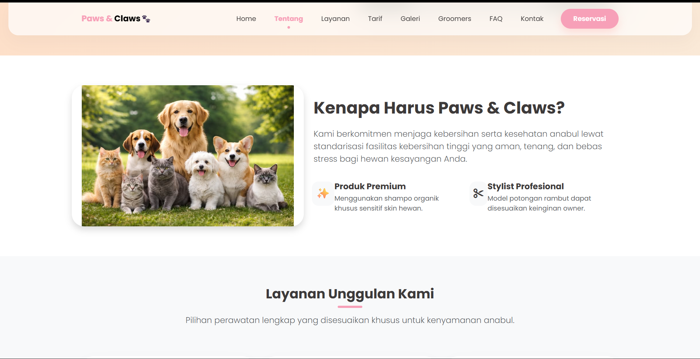
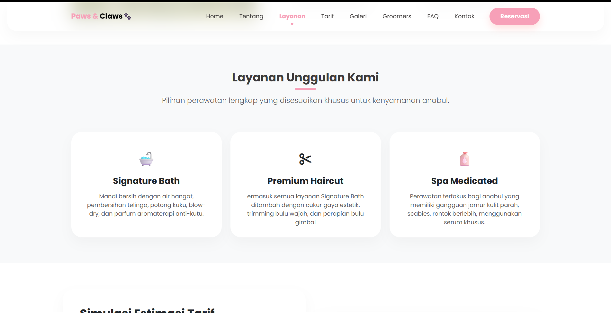
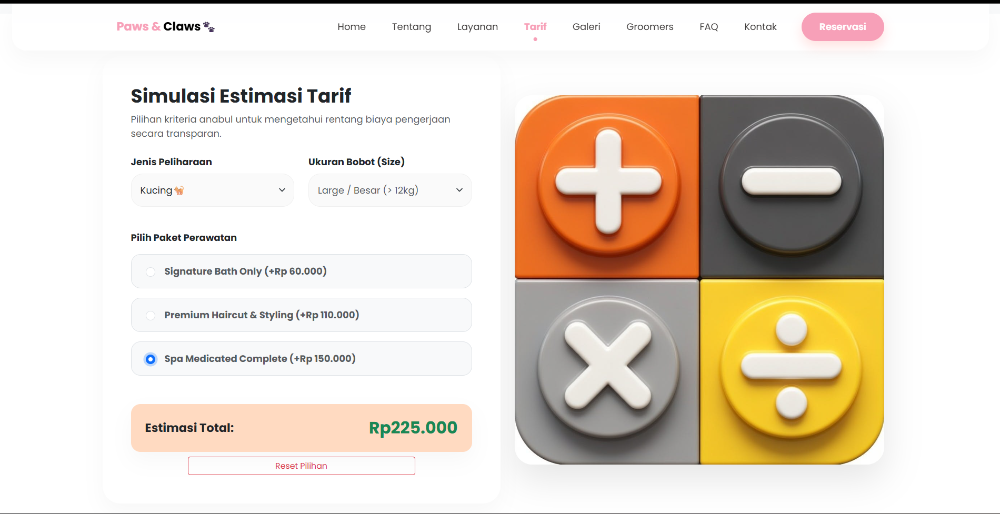
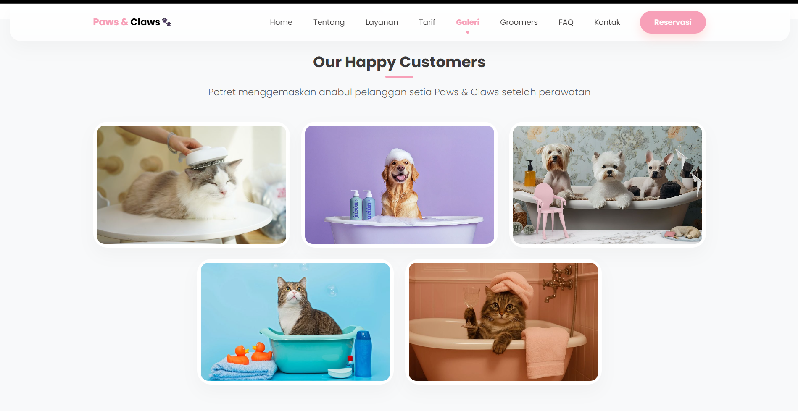
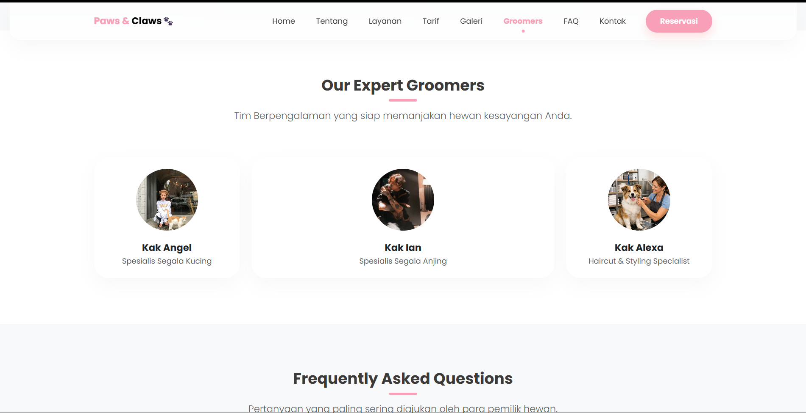
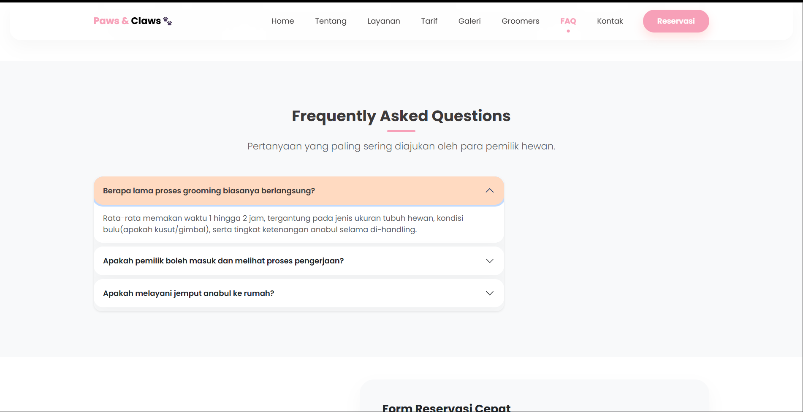
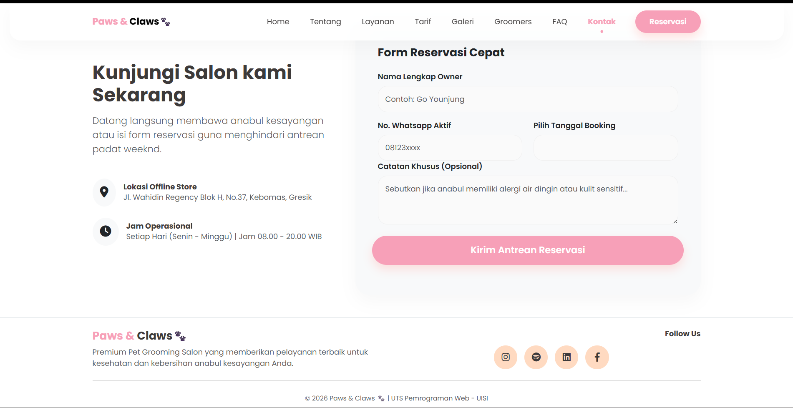

#  Paws & Claws🐾
## 💫 About The Project
```txt
🐶 Fictional Pet Grooming Salon Website
🎓 Mid-Term Project (UTS) - Web Programming
📱 Fully Responsive Design
💰 Interactive Grooming Price Calculator
🎨 Modern Pastel & Glassmorphism UI
🚀 Built with HTML, CSS, JavaScript, jQuery & Bootstrap

Paws & Claws is a modern company profile website designed for a fictional pet grooming salon.
The website provides information about grooming services, pricing estimates,
reservation booking, professional groomers, and salon facilities.
```
---
# 📸 Screenshots
### Home Page

---
### Tentang

---
### Layanan

---
### Tarif

---
### Galeri

---
### Groomers

---
### FAQ

---
### Footers

---

## 🎨 Design Inspiration
```txt
🎯 Inspired by modern landing page concepts
🎨 References from Dribbble & Pinterest
🐾 Adapted for Pet Grooming Business Theme
📚 Developed independently for academic purposes

Paws & Claws is a modern company profile website designed for a fictional pet grooming salon.
The website provides information about grooming services, pricing estimates,
reservation booking, professional groomers, and salon facilities.
```
---
## References
```txt
Dribble: https://dribbble.com/shots/27163316-Pufy-Puf-Pet-Grooming-salon
